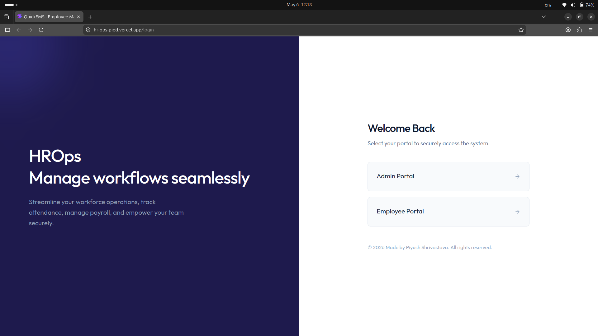

# HROps
HR Operations made easy. It simplifies complex HR workflows like leave requests and attendance tracking using automated background jobs.


## Live Demonstration

**Deployed URL:** [[https://hr-ops-pied.vercel.app/](https://hr-ops-pied.vercel.app/)]
[](https://hr-ops-pied.vercel.app/)


# Key Features

**Authentication**
* Secure role-based login system (Admin & Employee).
* JSON Web Tokens(JWT) securely managed via Local Storage.
* Encrypted passwords utilizing bcrypt.
* Implementation of protected routes to restrict unauthorized dashboard access.

**Employee Management**
* Comprehensive dashboard to onboard, update, and manage employee profiles.
* Track individual employee data, roles, and departmental assignments.

**Attendance Tracking**
* Real-time attendance logging and monitoring system.
* Functionality to view historical attendance records and statuses.
* Integration with Inngest for event-driven, asynchronous background processing

**Leave Management**
* Employees can seamlessly submit leave applications.
* Admins can review, approve, or reject leave requests with automated status updates.

**Payroll & Payslips**
* Automated payslip generation based on attendance and leave data.
* Integration with Inngest for event-driven, asynchronous background processing of payroll tasks and notifications.

**Scalable Architecture**
* Clean and modular MERN stack project structure.
* Clear separation of concerns between frontend client and serverless backend API.
* Followed API-driven design.


## Tech Stack Used

**Frontend**
* React.js
* Tailwind CSS
* Redux Toolkit (Global State Management)

**Backend**
* Node.js
* Express.js
* JWT 
* Bcrypt.js

**Database**
* MongoDB Atlas (Cloud Hosted)

**External Services & Infrastructure**
* Inngest (Background Jobs & Automation)
* Nodemailer (Email Service)
* Vercel (Serverless Deployment)


## Project Architecture

```text
HROps/
│
├── client/                 
│   ├── public/
│   ├── src/
│   │   ├── assets/          
│   │   ├── components/    
│   │   ├── hooks/          
│   │   ├── pages/           
│   │   ├── context/           
│   │   ├── App.jsx          
│   │   └── main.jsx        
│   ├── .env                 
│   ├── eslint.config.js    
│   ├── vercel.json
│   └── vite.config.js      
│
├── server/            
│   ├── config/             
│   ├── controllers/    
│   ├── inngest/
│   ├── middleware/    
│   ├── models/        
│   ├── routes/             
│   ├── server.js
│   ├── vercel.json               
│   └── .env                
│
└── .gitignore
└── README.md

```

## Testing

* Tested with **Bruno** for all APIs.
* Handles invalid input gracefully with appropriate status codes and messages.


## Contributing

Contributions are always welcome!
Fork the repo, make changes, and open a PR.


## Developed by-

**Piyush Shrivastava**
* Full Stack Developer
* [Portfolio](https://portfolio-v1-iota-gray.vercel.app/)
* [Linkedin](https://www.linkedin.com/in/piyush-shrivastava-58351825b/)